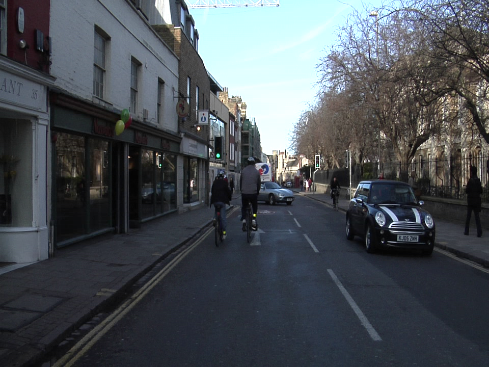
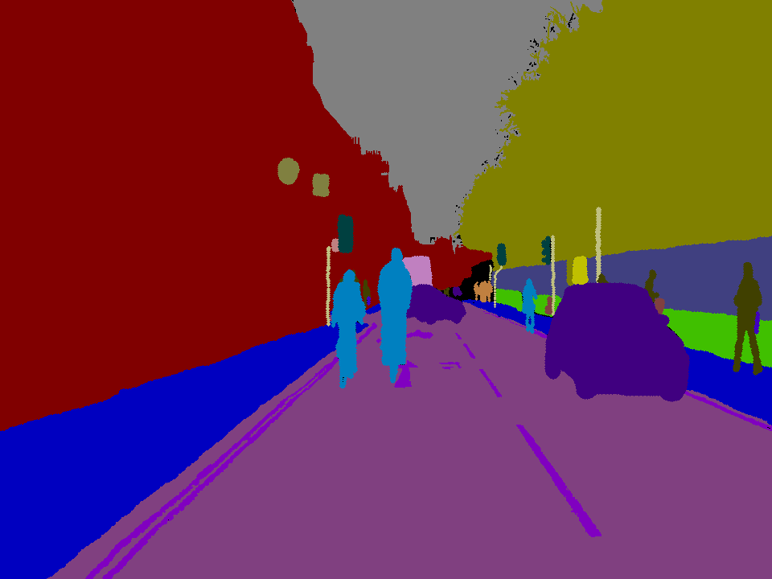

# Semantic_Segmentation-with-Camvid
This Repository contains Pytorch implementation of Semantic_Segmentation using ResNet34 architecture pretrained on ImageNet dataset.Google Colaboratory is used to run code.
* Pytorch/ResNet34 : https://github.com/pytorch/vision/blob/master/torchvision/models/resnet.py

### Resnet34 architecture from original paper:


### Left : Input Image ,Right : Target Image
  

### Files and Directories:

### Usage:
Firstly,set up the folders in following structur:
```
├── "dataset_name"                   
|   ├── train
|   ├── train_labels
|   ├── val
|   ├── val_labels
|   ├── test
|   ├── test_labels
```
Put a text file named "label_colors.txt" under the dataset directory which contains the list of classes along with the R, G, B colour labels to visualize the segmentation results. This kind of dictionary is usually supplied with the dataset. Here is an example for the CamVid dataset:
```
r,g,b,name
64 128 64	Animal
192 0 128	Archway
0 128 192	Bicyclist
0 128 64	Bridge
128 0 0		Building
64 0 128	Car
64 0 192	CartLuggagePram
192 128 64	Child
192 192 128	Column_Pole
64 64 128	Fence
128 0 192	LaneMkgsDriv
192 0 64	LaneMkgsNonDriv
128 128 64	Misc_Text
192 0 192	MotorcycleScooter
128 64 64	OtherMoving
64 192 128	ParkingBlock
64 64 0		Pedestrian
128 64 128	Road
128 128 192	RoadShoulder
0 0 192		Sidewalk
192 128 128	SignSymbol
128 128 128	Sky
64 128 192	SUVPickupTruck
0 0 64		TrafficCone
0 64 64		TrafficLight
192 64 128	Train
128 128 0	Tree
192 128 192	Truck_Bus
64 0 64		Tunnel
192 192 0	VegetationMisc
0 0 0		Void
64 192 0	Wall
```
